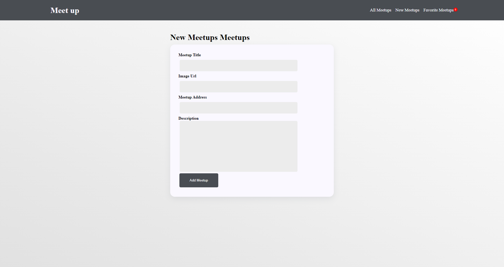
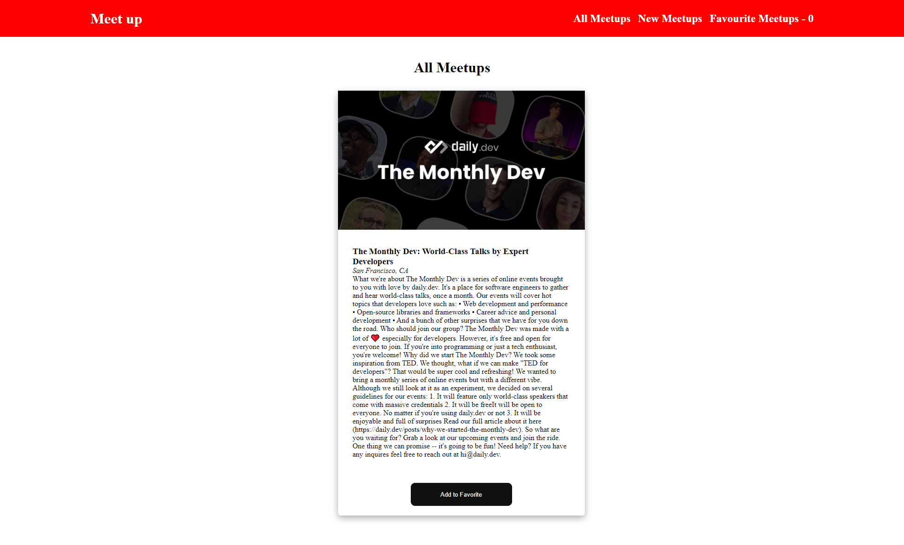

 

 
# Meetup ReactJS app

A amazing app where u can create meetup with Name, URL, Address and Description.

## Functionalities

- Create New Meetup

- Add meetup to Favorite

- Counter to maintain favorite list
  
  

## Environment Variables

To run this project, you will need to add the following environment variables to your .env file

`REACT_APP_FIREBASE_URL`

 Here u place your fireBaseURL.
 

    
## License

[MIT](https://choosealicense.com/licenses/mit/)
